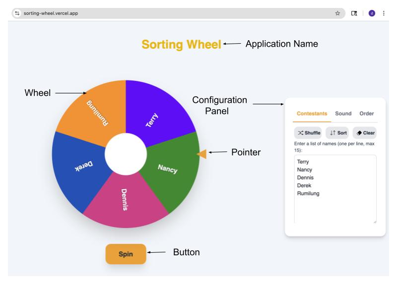
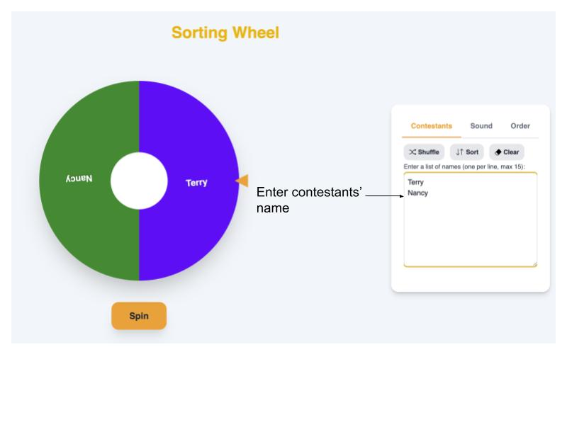
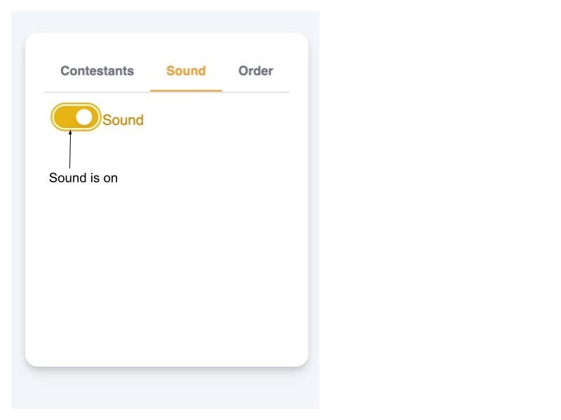
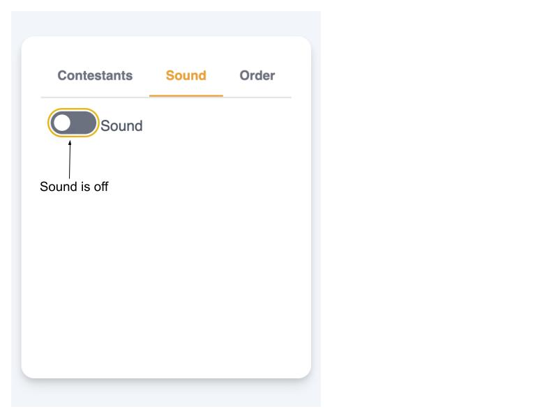
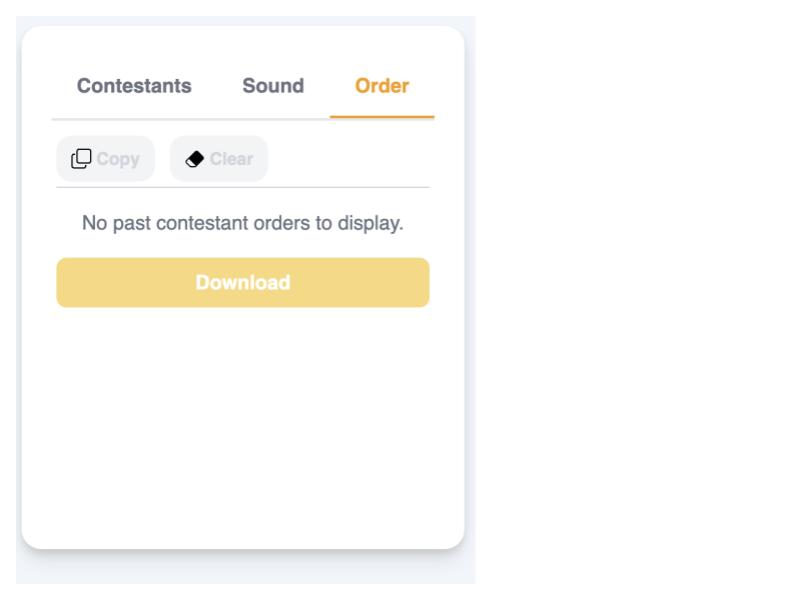
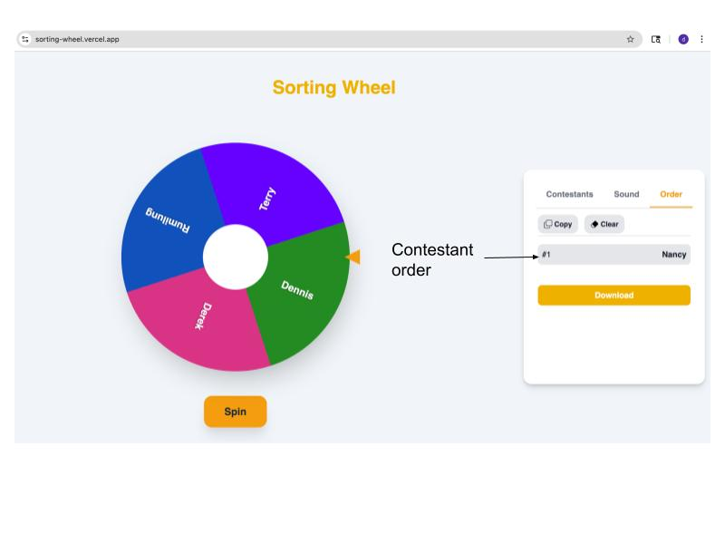
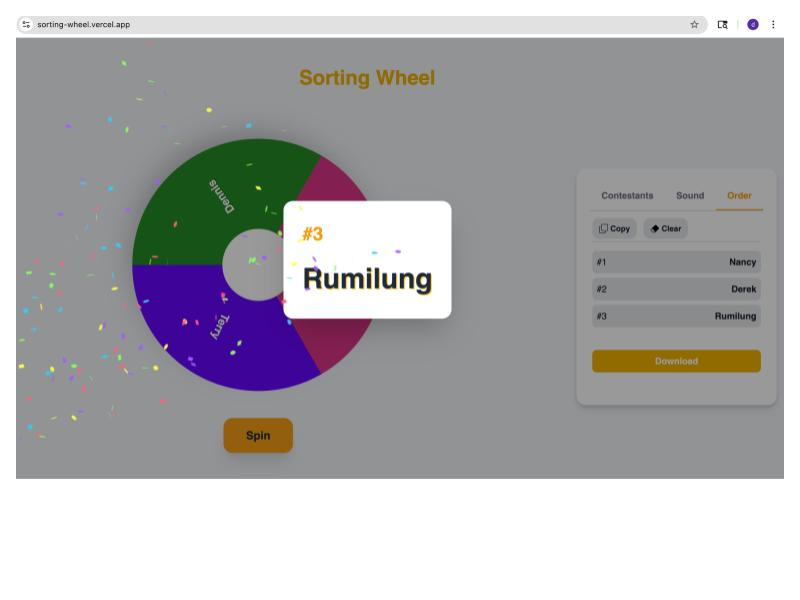
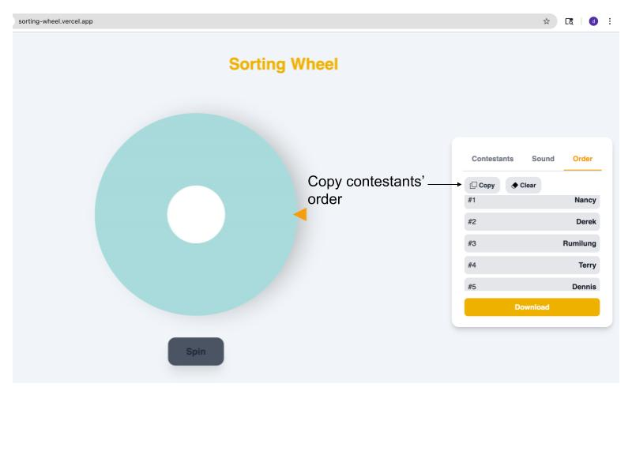
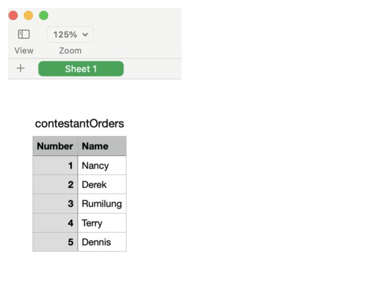
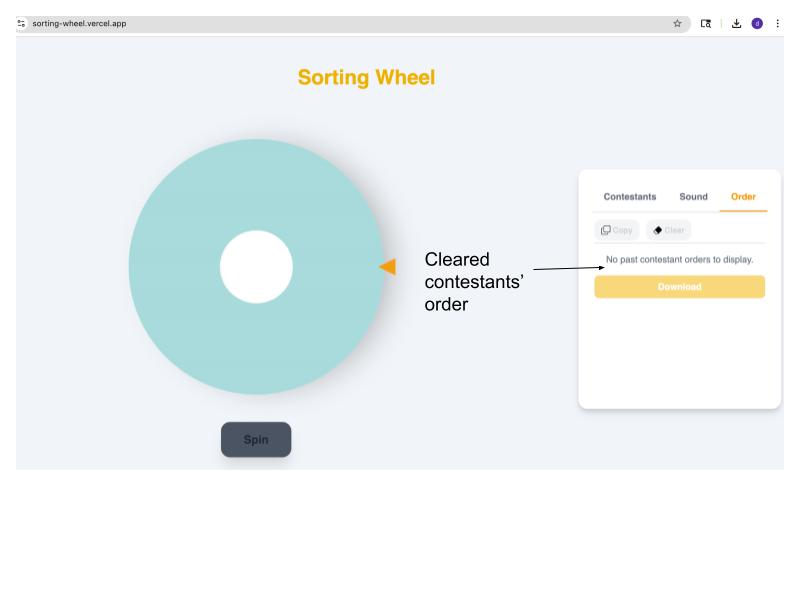

# Sorting Wheel User Guide

[Sorting Wheel](https://sorting-wheel.vercel.app/) is an application for picking contestants’ order in [San Francisco Toastmasters’s](https://www.toastmasters.org/Find-a-Club/1771-san-francisco-toastmasters) bi-annual contest. The application’s main components are the application name, wheel, spin button, segment pointer, and wheel configuration panel.

The following are the steps to use the wheel:

1. You enter the contestants’ name in the text area in the **Contestants** tab of the Configuration Panel. You can use the **shuffle**, **sort** or **clear** button as needed. The wheel will be populated as names are entered.

2. You can **turn on** or **off** the sound in the sound tab of the Configuration Panel by sliding the toggle button. Default is **on**. While sharing the screen in zoom, make sure to check the "Share sound" box in the "Share Screen" pop-up window before you begin sharing.

     &nbsp;
    

3. Order tab in the configuration is where the contestants’ order is placed. This is the default look when no contestant order has been picked. Once a contestant is in the order tab, **Copy** and **Clear** options are available.

4. Once the wheel is spinned, the contestant name with order is placed in the **Order** tab. You can select the **Order** tab and do the wheel spinning to see the tab being populated.

5. If the sound is turned on, sound will be played while the wheel is spinning and shout out with confetti.

6. Once all the contestants are picked by the wheel, you can **copy** the contestants’ order and **paste** in the place of your choice such as zoom chat for later use. You can also **download** the contestants’ order.

7. This is how the **download**ed csv file looks like.

8. Clear the order for the next round of choosing contestants’ order.

9. Repeat steps 1 to 8 for the next round of contestants’ order pick! Happy Sorting!
